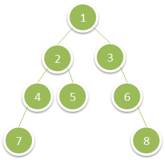

# 1302 - Deepest Leaves Sum

Given the root of a binary tree, return the sum of values of its deepest leaves.

## Examples:

```
Input: root = [1,2,3,4,5,null,6,7,null,null,null,null,8]
Output: 15
```